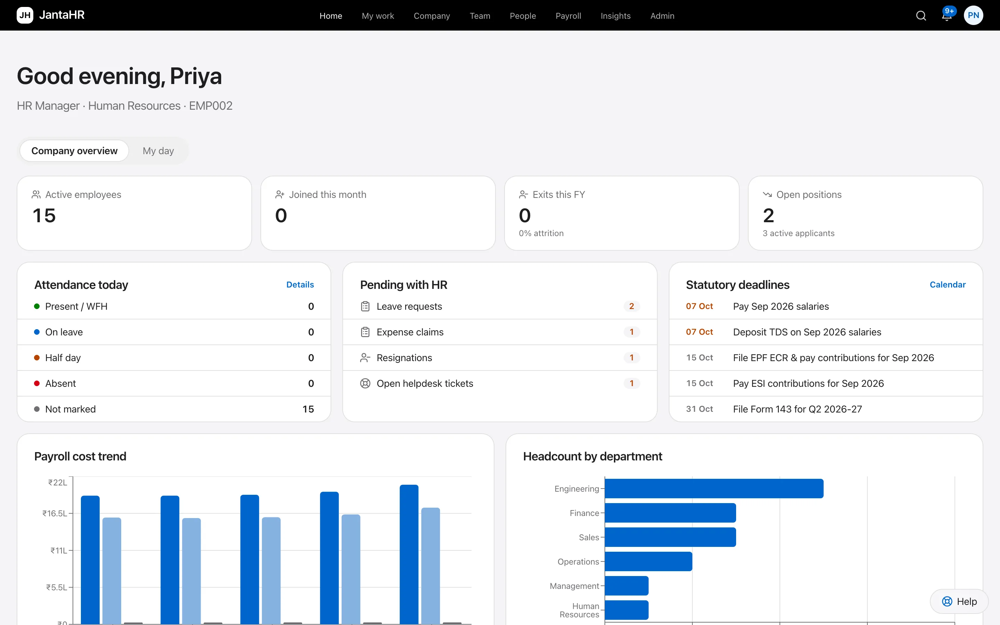
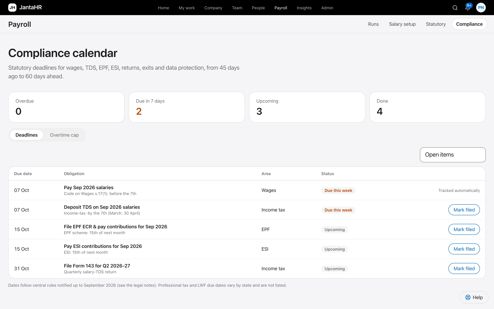
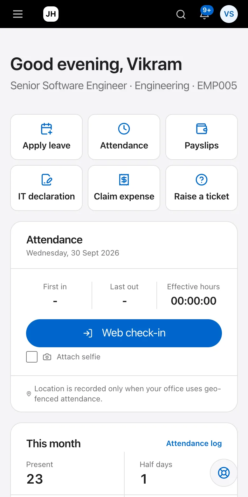

<div align="center">


# JantaHR

**Open-source HR and payroll for India.**<br>
PF, ESI, TDS, professional tax, LWF and the new labour codes, calculated every month. Self-host free, forever.

[Website](https://devag7.github.io/jantahr/) · [Self-host in one command](deploy/self-hosted/README.md) · [Cloud on Supabase + Vercel](docs/deploy-cloud.md) · [Legal basis](docs/legal-2026.md) · [Contributing](CONTRIBUTING.md)

[](LICENSE)
[](https://github.com/devag7/jantahr/actions/workflows/ci.yml)
[](https://github.com/devag7/jantahr/stargazers)




</div>

## Why JantaHR

Indian HR software is either closed SaaS priced per employee or a generic HRMS where you configure PF, ESI and TDS
yourself. JantaHR is neither:

- **The statutory work is done.** EPF with the ₹25,000 wage ceiling, ESI coverage, state professional tax (including
  half-yearly states), labour welfare fund, TDS under the Income-tax Act 2025 with old and new regimes, labour-code
  wages under the 50% rule, bonus, gratuity and full and final settlement. Every rule links to its notification in
  [`docs/legal-2026.md`](docs/legal-2026.md).
- **You own it.** Self-host the complete product on the Supabase stack (Postgres 17 + OrioleDB) with one command:
  every feature, no employee limit, no licence key. Or use the cloud edition hosted in India.
- **Filing-ready outputs.** EPF ECR, ESI contribution file, PT and LWF registers, bank advice, Form 130 salary
  certificates and the quarterly TDS extract, plus a compliance calendar that tracks every due date.
- **Privacy law built in.** DPDP Act 2023 consent ledger, data export, correction and erasure with the 90-day window,
  breach register and retention-aware anonymisation. PAN, Aadhaar and bank numbers are encrypted field by field.

## Features

| Area | What you get |
|---|---|
| **People** | Employee records (80+ fields), departments, org chart, directory, documents with verification, CSV import |
| **Payroll** | Formula-driven structures, proration, LOP from attendance, arrears, bonus, loans, payslips, Form 130, run → approve → paid |
| **Statutory** | PF, ESI, PT, LWF, TDS, ECR and challan files, compliance calendar, labour codes, bonus and gratuity |
| **Time** | Leave policies with accrual and encashment, shifts and rosters, geo-fenced and selfie check-in, biometric push |
| **Lifecycle** | Onboarding checklists, resignation, clearances, full and final settlement, relieving letters |
| **Growth** | Appraisal cycles, calibration, salary revision, careers page, applicant pipeline, one-click hire |
| **Self-service** | Web and mobile (Expo) apps for leave, attendance, payslips, tax declarations, expenses and helpdesk |
| **Security** | Supabase Auth with two-factor, role-based access, tenant isolation, audit log, row-level security |

<table>
<tr>
<td width="62%"></td>
<td width="38%" align="center"></td>
</tr>
</table>

## Start in 60 seconds

```bash
git clone https://github.com/devag7/jantahr
cd jantahr/deploy/self-hosted
./jantahr.sh setup && ./jantahr.sh up      # Supabase (Postgres 17 + OrioleDB) + JantaHR
```

Open http://localhost:3000, create your company and you are running. Details: [self-hosting guide](deploy/self-hosted/README.md).
Developing on JantaHR? See [Quick start (local)](#quick-start-local) and [CONTRIBUTING.md](CONTRIBUTING.md).

## Stack

| | |
|---|---|
| **API** | NestJS 10 · TypeScript · Prisma 5 · PostgreSQL 16/17 (OrioleDB) (`packages/backend`) |
| **Web** | Next.js 14 (App Router) · React 18 · Tailwind with an Apple-style design system ([`docs/design-system.md`](docs/design-system.md)) · TanStack Query · Zustand (`packages/frontend`) |
| **Mobile** | Expo SDK 51 / React Native (`packages/mobile`): sign-in with two-factor, geo and selfie check-in, leave, payslips |
| **Platform** | Supabase (Auth, Postgres, Storage, Realtime, Edge Functions, pg_cron) · Vercel · Docker · Terraform for AWS ap-south-1 · GitHub Actions |

## Editions

| | Self-hosted | Cloud |
|---|---|---|
| Runs on | Your server: the Supabase self-hosting stack with **Postgres 17 + OrioleDB**, Storage, Realtime, Auth, Edge Functions, plus the JantaHR API and web containers | Supabase project (Mumbai) + two Vercel projects |
| Features | Everything, no seat limit, no licence key | By plan: Free (up to 20 employees), Standard, Professional, Enterprise; 14-day Professional trial |
| Billing | None | Razorpay subscriptions per seat, GST tax invoices (CGST + SGST or IGST) |
| Scheduled jobs | In-process (`JOBS_MODE=inprocess`) | pg_cron → Edge Function and Vercel Cron → `/internal/jobs/*` |
| File uploads | Through the API (multipart) | Browser → Storage with presigned URLs (Vercel's 4.5 MB body cap) |
| Guide | [`deploy/self-hosted/README.md`](deploy/self-hosted/README.md) | [`docs/deploy-cloud.md`](docs/deploy-cloud.md) |

One codebase and one schema serve both; `EDITION` (API) and `NEXT_PUBLIC_EDITION` (web) select the behaviour.

## Quick start (local)

```bash
pnpm install
docker compose up -d postgres redis          # Postgres on :5439
cp packages/backend/.env.example packages/backend/.env   # then set JWT_SECRET / ENCRYPTION_KEY and SUPABASE_*
# sign-in is Supabase Auth: point SUPABASE_* at a Supabase project, or run the local test double
GOTRUE_JWT_SECRET=local-gotrue-jwt-secret-0123456789abcdef GOTRUE_SERVICE_KEY=service-local-key pnpm --filter jantahr-backend gotrue:stub &
pnpm --filter jantahr-backend prisma:generate
pnpm db:migrate                               # apply migrations
pnpm db:seed                                  # demo company, 15 employees, 5 months of paid payroll
pnpm dev                                      # API :3002, web :3000  (API docs: http://localhost:3002/docs)
pnpm --filter jantahr-backend doctor          # checks env, database, Supabase Auth, storage; prints the fix for each problem
```

> With the local test double: `SUPABASE_URL=http://localhost:9999 SUPABASE_PUBLISHABLE_KEY=anon-local
> SUPABASE_SECRET_KEY=service-local-key SUPABASE_JWT_SECRET=<GOTRUE_JWT_SECRET>` for the API, and
> `NEXT_PUBLIC_SUPABASE_URL=http://localhost:9999 NEXT_PUBLIC_SUPABASE_PUBLISHABLE_KEY=anon-local` for the web app. It keeps
> accounts in memory (or in `GOTRUE_STUB_FILE`) and sends no email; use a real Supabase project for reset links and Google.

> Port 3002 must be free. If a stale dev server is still running from an earlier session, stop it first.

Sign in at http://localhost:3000 (the login page shows one-click demo accounts while `NEXT_PUBLIC_SHOW_DEMO_LOGINS=true`):

| Account | Password | Role |
|---|---|---|
| `admin@jantahr.com` | `Admin@123` | Super admin |
| `hr@jantahr.com` | `Demo@1234` | HR admin |
| `payroll@jantahr.com` | `Demo@1234` | Payroll admin |
| `manager@jantahr.com` | `Demo@1234` | Manager (Engineering) |
| `employee@jantahr.com` | `Demo@1234` | Employee |
| `auditor@jantahr.com` | `Demo@1234` | Read-only auditor |

New company: `/signup` creates a tenant with India defaults (8 leave types + policy, salary components and a
CTC structure, general shift, holiday lists).

## What's implemented

| Area | Highlights |
|---|---|
| **Auth & security** | Supabase Auth is the only identity provider (passwords, sessions and refresh-token rotation, reset and sign-in links, Google, TOTP two-factor); the API verifies every Supabase token (JWKS or HS256) and enforces account status, HR-ended sessions and AAL2 for two-factor users; rate limiting, helmet, audit log of every write, RBAC guards, tenant isolation, AES-256-GCM field encryption for PAN / Aadhaar / bank account, masked views for non-privileged roles |
| **Core HR** | Employees (80+ fields), departments (tree), designations, org chart, directory, documents (verify workflow), CSV import, holiday calendars by state, announcements, policies with versioned acknowledgements |
| **Leave** | Types with sandwich rule, carry-forward, encashment, gender/tenure rules; policies; monthly earned-leave accrual (cron + backfill); half-day; overlap/balance/max-continuous checks; approve/reject/cancel with ledger; comp-off; encashment → payroll; payroll-lock protection |
| **Attendance** | Web/mobile check-in with geo-fence + selfie, biometric push API (per-device key), shifts / rotating rosters, late/early/overtime, regularisation / WFH / on-duty requests, nightly finalisation, manual + CSV entry |
| **Payroll** | Formula-driven structures (safe evaluator), mid-month joiner/leaver & mid-period revision proration, LOP from attendance, PF (EPS/EPF split, ceiling), ESI, state PT, LWF, arrears/bonus/recoveries, loans, TDS with annual projection (old & new regime, tax year 2026-27 under the Income-tax Act 2025 and FY 2025-26; rebate + marginal relief, surcharge, cess, HRA in 8 metros, Rules 2026 allowance exemptions), investment declarations, run → approve → paid workflow with reopen, payslip PDF, Form 16 summary |
| **Statutory & bank** | EPFO ECR file, ESI CSV, PT report, bank advice, salary register, Form 24Q extract, statutory bonus, gratuity in F&F |
| **Lifecycle** | Onboarding checklists (auto-started), resignation → approval → clearances → exit interview → full & final (last salary, encashment, gratuity, notice recovery, loans) → relieving / experience letters |
| **Performance** | Cycles, goals with weightage, self → manager → HR appraisal, calibration, salary revision applied to CTC |
| **Expenses / helpdesk** | Claims with receipts, per-line approval, reimbursement through payroll, travel requests, ticketing with comments |
| **Recruitment** | Jobs, public careers page + application form, pipeline board, interviews, offers, one-click hire → employee |
| **Reports & insights** | Admin / manager / employee dashboards, 18 MIS reports, custom report builder (whitelisted, permission-aware), attendance anomaly detection, attrition-risk score (transparent heuristic) |
| **Privacy (DPDP)** | Consent ledger enforced at check-in (selfie/GPS) and the AI assistant, versioned privacy notice, downloadable personal-data export, correction / erasure / grievance / nomination requests with the 90-day response window of the DPDP Rules 2025, breach register with employee notification, retention-aware erasure (partial while statutory records must be kept, full anonymisation afterwards), applicant consent + automatic 12-month anonymisation, nightly housekeeping |
| **Billing (cloud)** | Plans and seat limits enforced server-side (402 `PLAN_REQUIRED` / `SEAT_LIMIT`), trial, read-only fallback when a subscription lapses, Razorpay checkout and idempotent webhook inbox, GST invoice numbering and PDF |
| **Assistant** | Intent-based answers from the user's own data; policy Q&A (LLM if `ANTHROPIC_API_KEY` set, otherwise keyword retrieval) |

## Roles

`SUPER_ADMIN` and `HR_ADMIN` administer everything (only Super Admin can grant admin roles) · `PAYROLL_ADMIN` runs payroll
and sees compensation · `MANAGER` sees and approves their reporting tree · `EMPLOYEE` sees themselves ·
`AUDITOR` read-only with masked PII.

## Testing

```bash
pnpm --filter jantahr-backend test:unit       # 126 unit tests: formula parser, PF/ESI/PT/LWF, tax, HRA, gratuity, LOP, leave days, attendance, crypto, billing/GST, Supabase JWT + auth guard, direct uploads
pnpm --filter jantahr-backend build && PORT=3002 node packages/backend/dist/main.js &
API=http://localhost:3002 pnpm --filter jantahr-backend test:e2e   # 246 assertions across every module + Supabase sign-in, 2FA, HR resets + RBAC + tenant isolation (needs a freshly seeded DB and the same Supabase Auth as the API)

# cloud edition: start the API with EDITION=cloud BILLING_PROVIDER=mock CRON_SECRET=<32+ chars> RAZORPAY_WEBHOOK_SECRET=<secret>
API=http://localhost:3002 CRON_SECRET=… RAZORPAY_WEBHOOK_SECRET=… pnpm --filter jantahr-backend test:billing   # 36 assertions: plans, checkout, GST invoice, seat limits, webhooks, read-only fallback

# against a real Supabase project (no emails sent, cleans up after itself; do not point the e2e suite at one:
# its sign-ups send confirmation emails)
node --env-file=packages/backend/.env packages/backend/test/live-supabase-check.mjs   # 16 checks: tokens, admin API, bans, TOTP
```

CI (`.github/workflows/ci.yml`) runs migrations, a schema-drift check, type-checks, unit tests, the e2e suite,
frontend build, `terraform validate` and both Docker builds.

## Deployment

- **Self-hosted (Supabase + OrioleDB, one command):** [`deploy/self-hosted/README.md`](deploy/self-hosted/README.md)
- **Cloud (Supabase + Vercel, Razorpay billing):** [`docs/deploy-cloud.md`](docs/deploy-cloud.md)
- **Plain containers or AWS:**

```bash
# containers
JWT_SECRET=… ENCRYPTION_KEY=… docker compose --profile app up -d --build

# AWS (Mumbai): VPC, RDS (KMS), S3 documents bucket, Secrets Manager, ECR, ECS Fargate + autoscaling, ALB host routing, WAF
cd infra && cp terraform.tfvars.example terraform.tfvars && terraform init && terraform apply
```

The API applies pending Prisma migrations on start. Set `STORAGE_DRIVER=s3` + `S3_BUCKET` in any multi-node / Fargate
deployment (local-disk storage is dev-only). **Back up `ENCRYPTION_KEY`**: without it encrypted PAN / Aadhaar / bank
fields cannot be recovered.

Environment variables: see `packages/backend/.env.example`.

## Legal basis

What each statutory rule is, where it comes from and what is still open: [`docs/legal-2026.md`](docs/legal-2026.md)
(labour codes in force 21-Nov-2025, EPF ceiling ₹25,000 from 17-Sep-2026, Income-tax Act 2025, DPDP Rules 2025). A
statutory **compliance calendar** (`/compliance/calendar`, web: *Compliance*) tracks wage payment, TDS, PF, ESI,
quarterly returns, bonus, F&F, gratuity and DPDP deadlines.

## Known limits: read before production

See [`docs/compliance.md`](docs/compliance.md). In short: statutory tables (PT, LWF, tax slabs, holidays) are
**seed defaults that a CA must validate**; Redis is provisioned but not yet used (jobs run on `@nestjs/schedule`);
the mobile app is type-checked but has not been run on a device or simulator; DPDP tooling tracks the workflow but does not file with the Data Protection Board; there is no bank-API salary disbursement,
SSO (SAML/OIDC), Tally/Zoho export, multi-language UI or push-notification service yet.

## Contributing

Contributions are welcome, especially state rules (professional tax slabs, LWF, holidays) and statutory updates. Read
[CONTRIBUTING.md](CONTRIBUTING.md), and report security issues privately as described in [SECURITY.md](SECURITY.md).

## License

[GNU AGPL-3.0](LICENSE). You may self-host, modify and redistribute JantaHR; if you offer a modified version as a
network service, you must publish your changes under the same licence.
